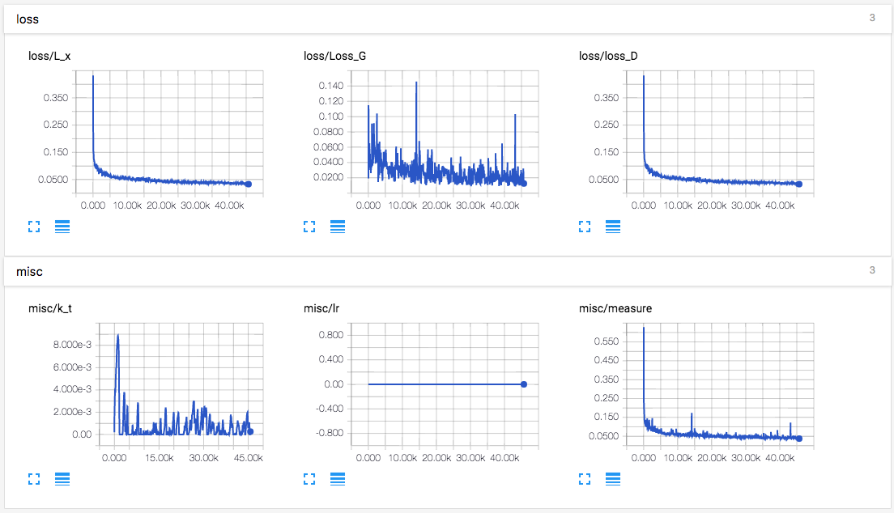

# BEGAN in PyTorch

PyTorch implementation of [BEGAN: Boundary Equilibrium Generative Adversarial Networks](https://arxiv.org/abs/1703.10717).

## Requirements

- Python 2.7
- [Pillow](https://pillow.readthedocs.io/en/4.0.x/)
- [tqdm](https://github.com/tqdm/tqdm)
- [PyTorch](https://github.com/pytorch/pytorch)
- [torch-vision](https://github.com/pytorch/vision)
- [requests](https://github.com/kennethreitz/requests) (Only used for downloading CelebA dataset)
- [TensorFlow](https://github.com/tensorflow/tensorflow) (Only used TensorBoard for logging)

## Usage

First download [CelebA](http://mmlab.ie.cuhk.edu.hk/projects/CelebA.html) datasets with:

    $ apt-get install p7zip-full # ubuntu
    $ brew install p7zip # Mac
    $ python download.py

or you can use your own dataset by placing images like:

    data
    └── YOUR_DATASET_NAME
        ├── xxx.jpg (name doesn't matter)
        ├── yyy.jpg
        └── ...

To train a model:

    $ python main.py --dataset=CelebA --num_gpu=1
    $ python main.py --dataset=YOUR_DATASET_NAME --num_gpu=4 --use_tensorboard=True

To test a model (use your `load_path`):

    $ python main.py --dataset=CelebA --load_path=logs/CelebA_0404_105537 --num_gpu=0 --is_train=False

## Results

Failed to reproduce the result of the paper. Looks like `k_t` doesn't head to `gamma` and there is a mode collapsing problem (not sure how the paper deals with this without pulling-away term of EBGAN).

(in progress)

## Author

Taehoon Kim / [@carpedm20](http://carpedm20.github.io)
